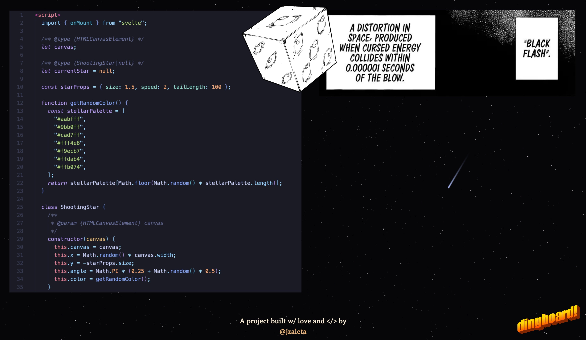

# night-skies ✨

<p align="center">
Starry-sprinkled night skies with shooting stars and lofi beats coded with Sveltekit + Threlte (three.js) for the 3D environment.
<p>



> https://x.com/_jzaleta/status/1837002679442174433

## Installing

### Prerequisites

Things you'll want installed:

- [Git](https://git-scm.com)
- [Node.js](https://nodejs.org/en) or [nvm](https://github.com/nvm-sh/nvm)

#### 1. First clone my git repo in a terminal and install dependencies

```
git clone https://github.com/jzaleta/night-skies.git
cd night-skies
npm install
```

#### 2. Then start the local dev server

```bash
npm run dev

# or start the server and open the app in a new browser tab
npm run dev -- --open
```

## Contributing

This project **_isn't really open to big contributions_** since it's personal, but if you spot something like a spelling mistake, a visual bug or other kinds of weird things happening, please feel free to create an issue.

## License

This project is made open-source with the [MIT License](LICENSE).
